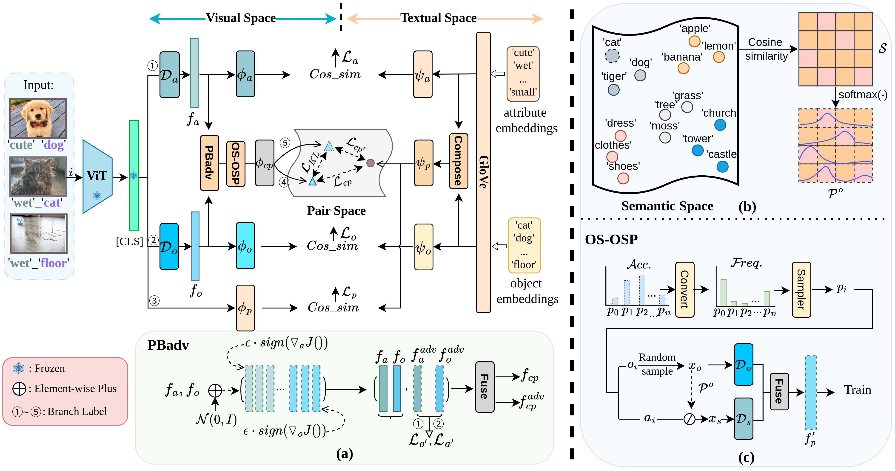

# Learning Contextual Interaction via Primitive-Based Adversarial Training for Compositional Zero-shot Learning
The PyTorch implementation of 2024 works [Learning Contextual Interaction via Primitive-Based Adversarial Training for Compositional Zero-shot Learning](https://). 


<p align="center">
  
</p>

## Setup
The datasets and the necessary configuration files can be accessed as referenced in: [CGE](https://github.com/ExplainableML/czsl). 
Before you run our code, please check the file and dataset structure:
```
 PrBaAdv
    └─ configs
    │     └─... 
    └─ data  
    │   └─cgqa
    │   │  └─compositional-split-natural
    │   │  └─images
    │   └─ut-zap50k
    │   │    └─compositional-split-natural
    │   │    └─images
    │   │    └─metadata_compositional-split-natural.t7
    │   └─mit-states
    │      └─compositional-split-natural
    │      └─images
    │      └─metadata_compositional-split-natural.t7
    └─ models
    │     └─... 
    └─ validation
    │     │  
    │     └─mit
    │        └─mit.yml
    │        └─ckpt_best_auc.t7  
    │        
    └─...      
```
**Sample**: the pre-trained weight of ViT-B is as same as [ADE](https://haoosz.github.io/ade-czsl/), we offer a quick link:[backbone_weight](https://drive.google.com/file/d/1tVCnNKIMI5HaXT73jgSnvy01Kn4kDw5Q/view?usp=sharing)
### Environment
We recommend using Anaconda for environment setup. For simplicity, we have exported the environments we applied:

```
    conda env create --file environment.yml
    conda activate czsl
```

## Quick Validation

We save the training weights of our model in folder `validation`,  
**Sample**: Take MIT-States in the closed-world setting for example and the model weights can be downloaded from [model_weight](https://drive.google.com/file/d/12LAvAAzanbCTi5UowmZ6JFFTOteGrP46/view?usp=sharing);:

```
    python test.py --config 'configs/mit.yml'  --logpath ./validation/mit/
```
<p align="center">
  
</p>

## Training
If you want to train the model, please open the terminal and run:

```
    python train.py --config CONFIG_FILE
```
where `CONFIG_FILE` is the path to the model's configuration file. 
The configs folder contains configuration files for all methods, 
including `configs/utzappos.yml`, `configs/mit.yml`, and `configs/cgqa.yml` etc.
The 
For example, if you want to train on MIT-States, the command is:
```
    python train.py --config configs/mit.yml
```


## Acknowledgement
Our code is based on the following excellent projects, please consider citing:
  
*[CGE](https://github.com/ExplainableML/czsl)
  
*[ADE](https://haoosz.github.io/ade-czsl/)
  
*[StyleAdv](https://github.com/lovelyqian/StyleAdv-CDFSL)
